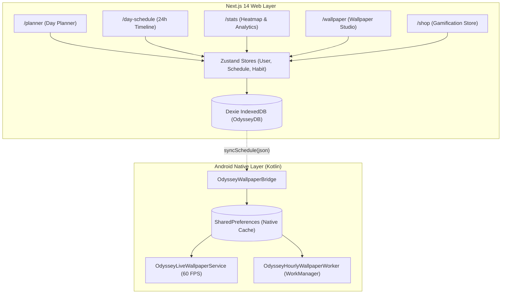

# Odyssey — Phase 0 Baseline Audit & Architecture Report

> **⚠️ HISTORICAL SNAPSHOT + ONE KNOWN FACTUAL ERROR.**
>
> - **Order and status:** `main_plan.md` at the repo root. Read that first.
> - **⚠️ §2 is wrong:** it states *"Next.js 14 Web Layer"*. The app is on **Next.js 16.3.5**.
>   Do not trust that diagram label. See `DEVELOPMENT_PLAN.md` §2.6.
> - Phase 0 is closed; its status tables have moved to `main_plan.md` §2.

**Version:** 1.0.0 (Phase 0 Complete)  
**Date:** October 2, 2026  
**Scope:** Active Codebase Audit, AST Dependency Analysis, Single Source of Truth Contract, Android Native Feasibility, and Phase 1 Handoff.

---

## 1. Executive Summary

Phase 0 has completed a comprehensive audit of the active Odyssey repository at `c:\PROJECTS\odyssey`.

- **AST Analysis (Graphify)**: 581 nodes, 1,047 edges, 30 functional communities mapped across TypeScript/React frontend and Kotlin Android native layers.
- **Data Ownership**: Established an authoritative **Single Source of Truth** model centered on Dexie (IndexedDB) with deterministic, one-way push to native Android services.
- **Native Platform Services**: Verified `OdysseyWallpaperBridge`, `OdysseyLiveWallpaperService`, and `OdysseyHourlyWallpaperWorker` for lock screen and home screen rendering.
- **Privacy & Permissions**: Verified 100% on-device local storage for core habits, schedules, focus logs, and gamification data with zero external tracking.

---

## 2. Codebase & Screen Inventory

### 2.1 Route & Feature Matrix

| Route / Screen | Current Working Features | Master Backlog Mapping | Status |
| :--- | :--- | :--- | :--- |
| **`/planner`** | 24-hour hour blocks, NOW/NEXT indicator, 3-state review toggle (`Circle` $\rightarrow$ `Check` $\rightarrow$ `Cross`), future hour lock. | `S1–S10`, `HD1`, `M1` | **Working** |
| **`/day-schedule`** | Vertical timeline with category tags, inline task creator, category picker, sleep auto-fill. | `S11–S20`, `M2` | **Working** |
| **`/stats`** | Month-navigable calendar heatmap, tap-for-24h-overview popup (4x6 breakdown), hold-to-open planner, rank tier badge. | `HD14–HD24`, `XL1–XL5` | **Working** |
| **`/wallpaper`** | Live Wallpaper Engine vs Static Auto-Updater, isolated custom lock & home photos, preview generator. | `M3`, `S14` | **Working** |
| **`/shop`** | Diamond store, streak-freeze purchase, daily mystery chest, rank badge gallery. | `XL6–XL15`, `M4` | **Working** |

---

## 3. Data Ownership & Architecture Contract

### 3.1 Single Source of Truth
To prevent split-brain states and race conditions:
1. **Dexie (IndexedDB `OdysseyDB`) is the sole authoritative store** for:
   - `profiles`: XP, level, diamonds, streak, militaryRank, equipped items.
   - `scheduleBlocks`: Date, startTime, endTime, title, category, status (`pending` | `completed` | `missed`).
   - `habits` & `habitLogs`: Habit metadata, daily completions, streak counters.
   - `weeklyReports`: Category time distributions and completion rates.
2. **Native Android SQLite / SharedPreferences acts strictly as a read-only cache**:
   - Received via `OdysseyWallpaperBridge.syncSchedule(scheduleJson)`.
   - Used exclusively by `OdysseyLiveWallpaperService` and background `WorkManager` when the web app is closed.

### 3.2 Time & Timezone Standard
- All dates are stored as ISO 8601 calendar strings (`YYYY-MM-DD`).
- All block times are stored as 24-hour format (`HH:mm`).
- Completed timestamps are stored in UTC ISO format (`YYYY-MM-DDTHH:mm:ss.sssZ`) with local presentation.

---

## 4. Android Native Platform Feasibility

| Permission / Service | Purpose | Policy & Platform Status |
| :--- | :--- | :--- |
| `android.permission.SET_WALLPAPER` | Setting lock/home static wallpapers | Install-time normal permission (0 runtime prompts required). |
| `android.permission.BIND_WALLPAPER_SERVICE` | Running the 60 FPS live wallpaper service | System-bound service permission (User selects via system wallpaper picker). |
| `android.permission.POST_NOTIFICATIONS` | Evening review & cadence reminders | Runtime permission requested only when user toggles notifications ON. |
| `android.permission.SCHEDULE_EXACT_ALARM` | Exact scheduled reminders | Optional with fallback to WorkManager cadence. |
| `android.permission.PACKAGE_USAGE_STATS` | Focus session app-blocking (Phase 2) | Opt-in system settings redirect with clear explanatory preview. |

---

## 5. Architectural God Nodes & Refactoring Recommendations

Graphify identified the top 5 architectural hubs in the repository:
1. **`OdysseyWallpaperBridge`** (34 dependencies): The central communication gateway. *Contract is stable and well-guarded.*
2. **`useUserStore`** (33 dependencies): Central gamification state. *Should be decoupled into profile vs inventory sub-slices in Phase 3.*
3. **`ScheduleBlock`** (19 dependencies): The core unit of time planning. *Model is clean and consistent.*
4. **`WallpaperPage`** (16 dependencies): Handles engine selection, preview generation, and native synchronization.
5. **`db`** (14 dependencies): Dexie database instance.

---

## 6. Phase 0 Exit & Phase 1 Handoff

> [!IMPORTANT]
> **Phase 0 is complete.** All assumptions from `PRODUCTION_PLAN.md` have been verified against active code, single data ownership is locked, and platform feasibility is established.

### Phase 1 Execution Brief (Ground-Up UI/UX Redesign)
- **Target**: Complete redesign of all screens using Stitch MCP.
- **Key UI Signatures to Implement**:
  - **HabitDriven Segmented Date Rings** prominently featured below the calendar date strip.
  - **Structured Vertical Schedule Rail** with stable category icons and visual breathing room.
  - **HabitBee Multi-View Switcher** (Grid, List, Heatmap).
  - **Regain Focus Radar Pulse** on session start with smooth, non-blocking animations.
- **Constraint**: Preserve all existing working Dexie storage, native bridge connections, and 3-state review toggle logic.
